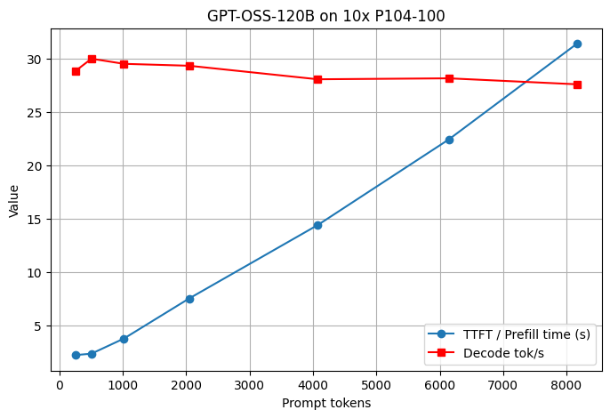

# GPT-OSS-120B on 10× P104-100 Pascal GPUs

Running GPT-OSS-120B Q4_K_M GGUF on Pascal mining GPUs using llama.cpp.
## TTFT vs Decode



# Tested configuration:

* 10× NVIDIA P104-100 8GB
* PCIe Gen1 x1
* llama.cpp CUDA backend
* GPT-OSS-120B Q4_K_M GGUF
* Ubuntu 24.04.4 LTS
* CUDA toolkit 12.0
* NVIDIA driver 535.288.01
* Intel Pentium G4620
* 16 GB RAM

The goal of this project is to show a practical configuration and working parameters for local GPT-OSS-120B inference on 10× P104-100 GPUs.

---

# Repository

Repository name:
```text
gpt-oss-120b-p104-pascal
```
---

## GPUs

```text
10× NVIDIA P104-100
8 GB VRAM each
Pascal GP104
Compute capability 6.1
PCIe Gen1 x1
Power limit: 180 W
```

Detected by:

```text
nvidia-smi --query-gpu=name,pci.bus_id,driver_version,vbios_version,memory.total,pcie.link.gen.current,pcie.link.width.current,power.limit --format=csv
```

Result:

```text
10× NVIDIA P104-100
PCIe Gen1 x1
8192 MiB each
```

# Software Environment

## OS

```text
Ubuntu 24.04.4 LTS
Kernel 6.17.0-23-generic
```

## CUDA

```text
CUDA toolkit 12.0
Driver 535.288.01
```

## Compiler

```text
GCC 13.3.0
```

## Python

```text
Python 3.12.3
```

## llama.cpp

```text
version: 9100
commit: 2e97c5f96
```

Built with:

```text
GNU 13.3.0 for Linux x86_64
```

---

# Model

Model used:

```text
GPT-OSS-120B
Q4_K_M GGUF
```

GGUF metadata:

```text
Architecture: gpt-oss
Layers: 36
Context length: 131072
Experts per layer: 128
Active experts: 4
Attention heads: 64
KV heads: 8
Embedding size: 2880
Model params: 116.83B
```


# Benchmark Configuration

Main benchmark configuration:

```text
CTX_SIZE=131072
PARALLEL=2
CTK=f16
BATCH=2048
UBATCH=1024
split-mode=layer
```
When using CTK=q8_0, the compute buffer size increased and VRAM fitting became worse, causing some configurations to no longer fit into GPU memory.

Tensor split:

```text
2/4/4/4/4/4/4/4/3/3
```

# Memory Usage

Projected VRAM usage:

```text
70480 MiB used
80255 MiB available
```
Free VRAM after allocation:

```text
GPU0  -> 2008 MiB free
GPU1  ->  421 MiB free
GPU2  ->  422 MiB free
GPU3  ->  422 MiB free
GPU4  ->  421 MiB free
GPU5  ->  422 MiB free
GPU6  ->  422 MiB free
GPU7  ->  421 MiB free
GPU8  -> 2066 MiB free
GPU9  -> 2748 MiB free
```

---

# Benchmark Results

| Prompt tokens | Prefill tok/s | Decode tok/s |
| ------------- | ------------: | -----------: |
| 255           |        114.72 |        28.88 |
| 504           |        214.41 |        30.02 |
| 1017          |        269.97 |        29.54 |
| 2044          |        271.72 |        29.36 |
| 4076          |        282.76 |        28.09 |
| 6142          |        273.66 |        28.18 |
| 8164          |        259.87 |        27.62 |
| 12280         |        234.57 |        26.50 |
| 16373         |        214.83 |        25.49 |
| 24560         |        182.66 |        23.78 |
| 32761         |        158.17 |        21.97 |
| 64423         |        104.89 |        18.14 |

---

# GPU Utilization

```text
10× Pascal GPUs
PCIe Gen1 x1
```
Average GPU utilization:
- Prefill: ~11–12%
- Decode: ~10–11%<br>
Most of the time, only one GPU was actively loaded at once. The GPUs operated sequentially both during prefill and decode.

# Power Consumption

Measured wall power:

| State                   |  Power |
| ----------------------- | -----: |
| Idle                    | ~123 W |
| Before VRAM loading     | ~128 W |
| Model loading into VRAM | ~222 W |
| Prefill stage           | ~680 W |
| Decode stage            | ~580 W |

# Final Notes
In this configuration, connecting GPUs through PCIe Gen1 x1 did not become a critical limitation for running GPT-OSS-120B.
